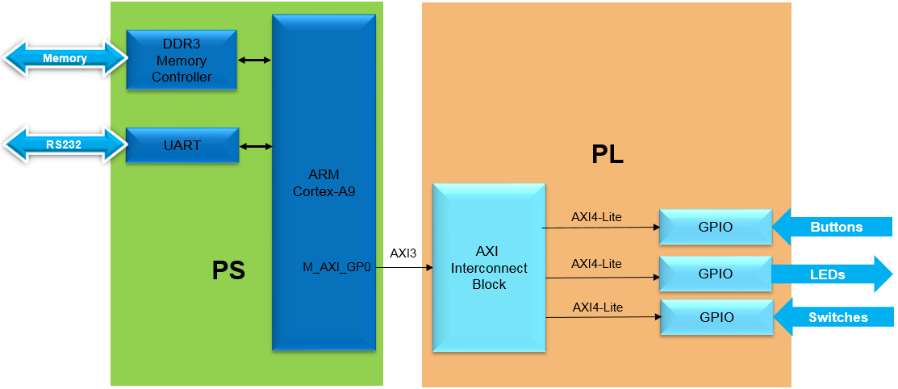
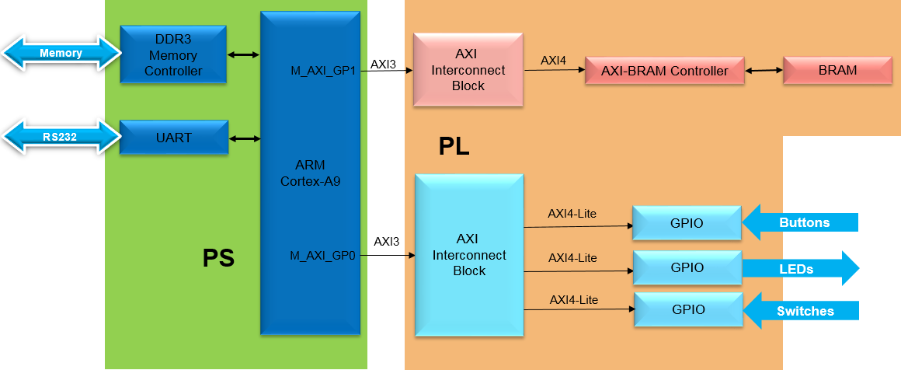

# Advanced Embedded System Design Flow on Zynq
This workshop provides participants the necessary skills to develop complex embedded systems and enable them to improve their designs by using the tools available in Vivado. It also helps developers understand and utilize advanced components of embedded systems design for architecting a complex system in the Zynq™ System on a Chip (SoC)

The labs have been developed on a PC running Microsoft Windows 7 professional edition and using **Vivado 2018.2** version tools.

## Source Files Setup

To use the source files for each of the labs in this workshop, you have to clone this repository from XUP Github. For that, do the following:

#### To be completed

---
#### In the instructions for the labs;

**{sources}** refers to C:\xup\adv_embedded\2018_2_zynq_sources. You can download the source files for the labs from [here](https://www.xilinx.com/support/university/vivado/vivado-workshops/Vivado-adv-embedded-design-zynq.html)

**{labs}** refers to C:\xup\adv_embedded\2018_2_zynq_lab. It assumes that you will create the mentioned directory structure to carry out the labs of this workshop

**{labsolutions}** refers to [here](https://www.xilinx.com/support/university/vivado/vivado-workshops/Vivado-adv-embedded-design-zynq.html). This will require you to login into your Xilinx account.

---
**NOTE**

Board support for the PYNQ-Z1 and PYNQ-Z2 are not included in Vivado 2018.2 by default. The relevant files need to be extracted and saved to:

 {Vivado installation}\data\boards\board_files\zynq

These files can be downloaded from [/board_files](https://www.xilinx.com/support/university/vivado/vivado-workshops/Vivado-adv-embedded-design-zynq.html). 

---

## Hardware Setup

**PYNQ-Z2**:  Connect the board to the PC using a micro USB cable. Make sure that a jumper is connected to JTAG (between JP1_1 and JP1_2) to use the board in the development mode.  Also, make sure that another jumper is placed between J9_2 and J9_3 to select USB as a power source.

## Labs Overview:

### Lab 1

This lab guides you through the process of using Vivado and IP Integrator to create a complete Zynq ARM Cortex-A9 based processor system targeting either the PYNQ-Z1 or PYNQ-Z2 boards.  You will use the Block Design feature of IP Integrator to configure the Zynq PS and add IP to create the hardware system, and SDK to create an application to verify the design functionality
    

    
    

    

    

### Lab 2
Software and hardware interact with each other in an embedded system.  The SDK includes System Debugger as a software debugging tool.  The hardware analyzer tool has different types of cores that allow hardware debugging by providing access to internal signals without requiring the signals to be connected to package pins. These hardware debug cores may reside in the programmable logic (PL) portion of the device and can be configured with several modes that can monitor signals within the design. In this lab you will be introduced to the various debugging cores.  
    

    
    

    

    

### Lab 3
The Zynq device supports various types of memory including volatile (e.g. DDR3) and non-volatile (e.g. QSPI Flash). There are volatile and non-volatile hard memory controllers on the Zynq PS. The PL portion of the Zynq device has plenty of Block RAM (BRAM) which can be used by an IP without contending for external resources and creating performance bottleneck. This lab guides you through the process of extending the memory space in Zynq-based platform using available PL based BRAM resource.
    

    
    

    

    

### Lab 4
In Zynq, multiple interconnections are available between the PS and PL sections with different performance levels for data transfer between the two subsystems. The General Purpose (GP) Master and Slave AXI interconnect used in the previous labs are intended for peripherals that do not have high bandwidth requirements. E.g. switches, leds, keyboard, mouse. There are four High Performance PS slave to PL master AXI interfaces available for peripherals that need higher bandwidth. E.g. Video and image processing applications. This lab guides you through the process of enabling a High Performance AXI slave port in the PS, adding an AXI central DMA (CDMA) controller, and performing Direct Memory Access (DMA) operations between various memories.
    

    
    

    

    

### Lab 5
This lab guides you through creating a bootable system capable of booting from the SD card or the QSPI flash memory located on the board. It also demonstrates how different bitstreams can be loaded in the PL section after the board is booted up and the corresponding application can be executed.
    

    
    

    

    

### Lab 6
This lab guides you through the process of profiling an application and analyzing the output. The application is then accelerated in hardware and profiled again to analyze the performance improvement. 
    

    
    

    

    

