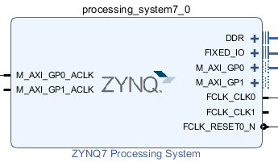
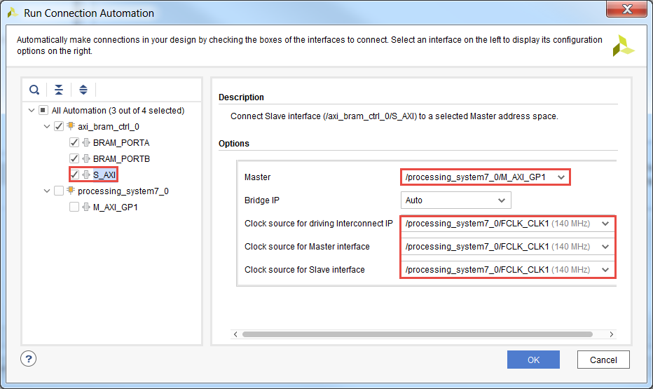
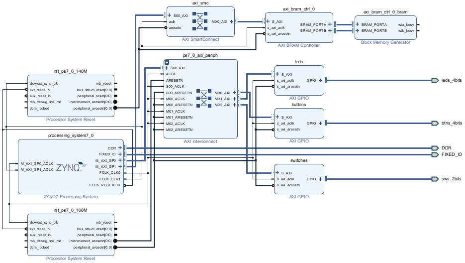
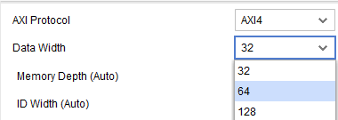
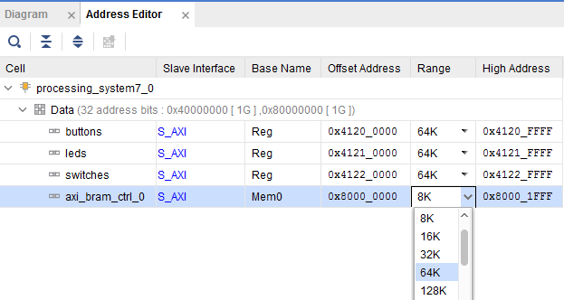
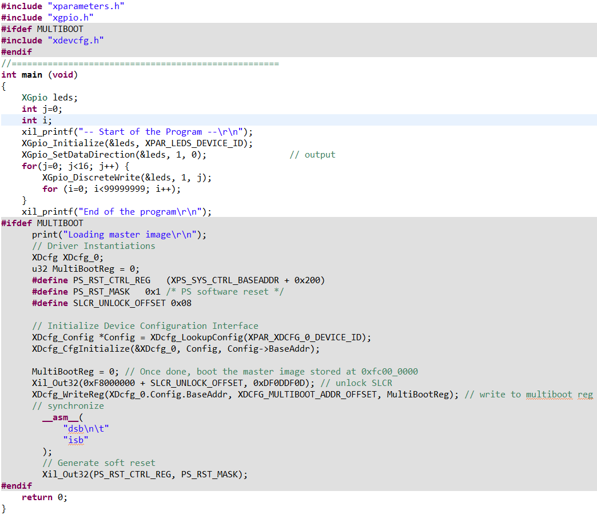

# Extending Memory Space with Block RAM

## Objectives

After completing this lab, you will be able to:

* Add BRAM and connect it to the processing system&#39;s AXI master port
* Execute the software application having data section in the BRAM

## Steps
## Open the Project        
### Open the Vivado program. Open the _lab1_ project you created earlier or use the _lab1_ project from the labsolution directory, and save the project as _lab3_.
1. Start Vivado if necessary and open either the _lab1_ project (lab1.xpr) you created earlier or the lab1 project in the _labsolutions_ directory using the **Open Project** link in the Getting Started page.
1. Select **File &gt; Project &gt; Save As …** to open the _Save Project As_ dialog box. Enter **lab3** as the project name.  Make sure that the _Create Project Subdirectory_ and _Import All Files to the New Project_ options are checked, the project directory path is **{labs}** and click **OK**.

    This will create the _lab3_ directory and save the project and associated directory with lab3 name.

## Configure the Processor to Enable M\_AXI\_GP1 
1. Open the Block Design and enable the M\_AXI\_GP1 interface.
1. Click **Open Block Design** in the _Flow Navigator_ pane
1. Double-click on the _Zynq processing system_ instance to open its configuration form.
1. Select _PS-PL Configuration_ in the Page Navigator window in the left pane, expand _AXI Non Secure Enablement&gt;GP Master AXI Interface_, and click on the check-box of the **M\_AXI GP1 Interface** to enable it.
1. Select _Clock Configuration_ in the Page Navigator window in the left pane, expand _PL Fabric Clocks_ on the right, and click on the check-box of the **FCLK\_CLK1** to enable it.
1. Enter the_Requested Frequency_for the **FCLK\_CLK1** as **140.00000** MHz.
1. Click **OK** to accept the settings and close the configuration form.

    

    
    

    

    <i>M_AXI_GP1 interface enabled</i>
    

## Extend with BRAM
### Add an AXI BRAM Controller instance with BRAM.
1. Click the  button and search for **BRAM** in the catalog.
1. Double-click the **AXI BRAM Controller** to add an instance to the design.
1. Click on **Run Connection Automation** , and select **axi\_bram\_ctrl\_0**
1. Click on **BRAM\_PORTA** and **BRAM\_PORTB** check boxes.
1. Click **S\_AXI** , and change the _Master_ option to **/processing\_system7\_0/M\_AXI\_GP1**, change the Clock source for driving interconnect IP, Clock source for Master interface,_ and _Clock source for Salve interface_ to **/processing\_system7\_0/FCLK\_CLK1 (140 MHz)** as they all run in the same clock domain, and click **OK**

    

    
    

    

    <i>Connecting AXI BRAM Controller to M_AXI_GP1 to run at faster clock speed</i>
    

    Notice that an instance of AXI SmartConnect and Processor System Reset are added, and the M\_AXI\_GP1\_ ACLK is connected to FCLK\_CLK1.

    

    
    

    

    <i>Clocking network connections</i>
    

1. Double-click on the **axi\_bram\_ctrl\_0** instance to open the configuration form.
1. Set the _Data Width_ to **64**.

    

    
    

    

    <i>Setting the BRAM controller data width to 64</i>
    

1. Click **OK**.
### Using the Address Editor tab, set the BRAM controller size to 64KB.  Validate the design.
1. Select the **Address Editor** tab and notice that the BRAM controller memory space is **8K**.
1. Click in the _Range_ column of the _axi\_bram\_ctrl\_0_ instance and set the size as **64K**.

    

    
    

    

    <i>AXI BRAM space assignment</i>
    

    Notice that the address range changed to 0x80000000-0x8000FFFF.  This is in the M\_GP1 addressing space.

1. Select the _Diagram_ tab, and click on the  (Validate Design) button to make sure that there are no errors.
## Generate the Bitstream        
1. Click on the **Generate Bitstream** to run the synthesis, implementation, and bit generation processes.
1. Click **Save** if prompted to save the project, and **Yes** to run the processes. Click **OK** to launch the runs.
1. When the bitstream generation process has completed successfully, click **Cancel**.
## Generate Applications in the SDK        
### Export the implemented design, and start SDK
1. Export the hardware configuration by clicking **File &gt; Export &gt; Export Hardware…**
1. Click the box to _Include Bitstream_and click **OK** (Click _Yes_ if prompted to overwrite the previous module)
1. Launch SDK by clicking **File &gt; Launch SDK** and click **OK**
1. Right-click on the **lab1** and **standalone\_bsp\_0** and **system\_wrapper\_hw\_platfrom\_0** projects in the Project Explorer view and select **close project**.
### Create an empty application project, named lab3, and import the provided lab3.c file.
1. Select **File &gt; New** &gt; **Application Project.**
1. In the _Project Name_ field, enter **lab3** as the project name.
1. Use the default settings to create a new BSP and click **Next.**
1. Select the **Empty Application** template and click **Finish.**

    The lab3 and lab3\_bsp projects will be created in the Project Explorer window of SDK.

1. Select **lab3 &gt; src** directoryin the project view, right-click, and select **Import.**
1. Expand the **General** category and double-click on **File System.**
1. Browse to **{sources}\lab3** folder.
1. Select **lab3.c** and click **Finish.**

    A snippet of the source code is shown in the following figure. It shows that we write a pattern to the LED port and execute a software delay loop. Repeat for 16 times. It also shows the code (greyed) which will be used in Lab5.

    

    
    

    

    <i>Source Code</i>
    

## Test in Hardware   
### Connect and power up the board. Establish the serial communication using the SDK Terminal tab.  Program the FPGA.
1. Connect and power up the board.
1. In SDK, select **Xilinx &gt; Program FPGA** and **c** lick the **Program** button to program the FPGA.
1. Select the  tab.  If it is not visible then select **Window &gt; Show view &gt; Terminal**.
1. Click on  to initiate the serial connection and select the appropriate COM port (depending on your computer). Configure it with 115200 baud rate.
### Run the lab3 application.
1. Select the **lab3** project in _Project Explorer_, right-click and select **Run As &gt; Launch on Hardware (System Debugger).** Click **Yes** to terminate the previous run.

    The application (lab3.elf) will be downloaded into the target device, execute ps7\_init, and execute.

1. You should see the on-board LEDs changing patterns at roughly a one second delay rate.
### Modify the linker scipt to use the ps7\_ddr\_0 for the code and data sections, and the BRAM for the Heap and Stack segments. Change the loop limit from 99999999 to 999999. Execute the program.
1. Select the **lab3** application in the _Project Explorer_ view.
1. Right-click and select **Generate Linker Script**.
1. Change the _code_ and _Data_ sections to **ps7\_ddr\_0** and the _Heap and Stack_ segment memory to **axi\_bram\_ctrl\_0\_Mem0.**
1. Click the **Generate** button.
1. Click the **Yes** button to overwrite.
1. Change the loop limit from 99999999 to **9999999**. Save changes so the program recompiles.
1. Select the **lab3** project in _Project Explorer_, right-click and select **Run As &gt; Launch on Hardware (System Debugger).**

    Click OK to terminate the exisiting run and relaunch if shown.

1. You should see the on-board LEDs changing patterns very slowly (about 5 seconds).
1. Change the loop limit from 9999999 to **999999**. Save changes so the program recompiles.
1. Select the **lab3** project in _Project Explorer_, right-click and select **Run As &gt; Launch on Hardware (System Debugger).**

    Click Yes to terminate the existing run.

1. You should see the on-board LEDs changing patterns relatively faster (about 1 seconds).
1. Close the SDK program by selecting **File &gt; Exit**.
1. Close the Vivado program by selecting **File &gt; Exit.**
1. Turn OFF the power on the board.

## Conclusion

This lab led you through adding BRAM memory in the PL section thereby extending the total memory space available to the PS. You have verified the functionality by creating an application, targeting the stack and heap sections to the added BRAM, and executing the application.
