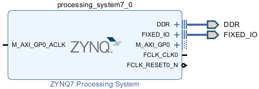
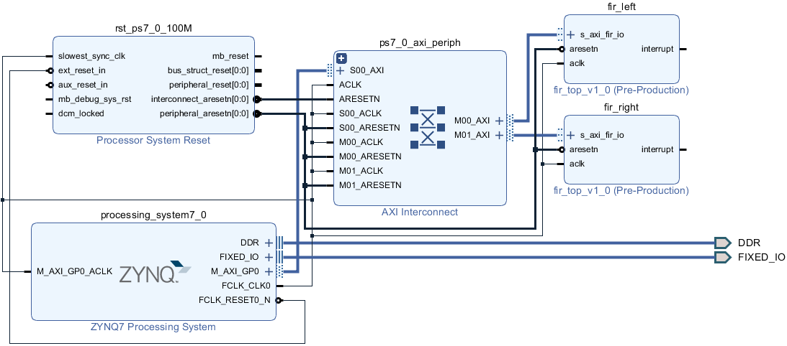
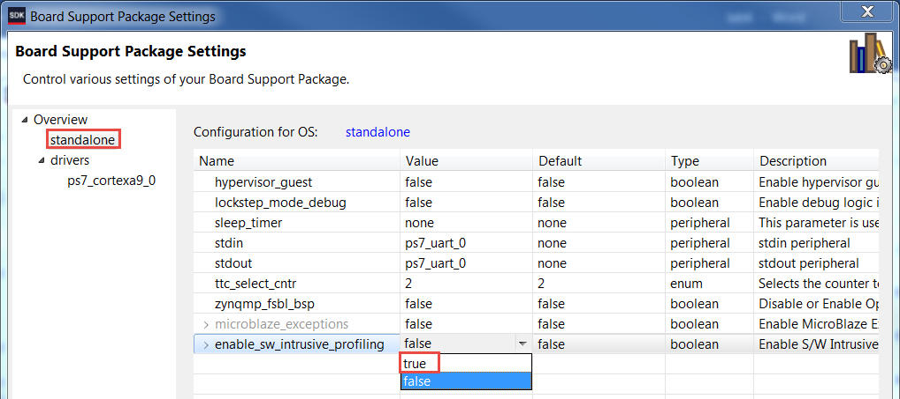
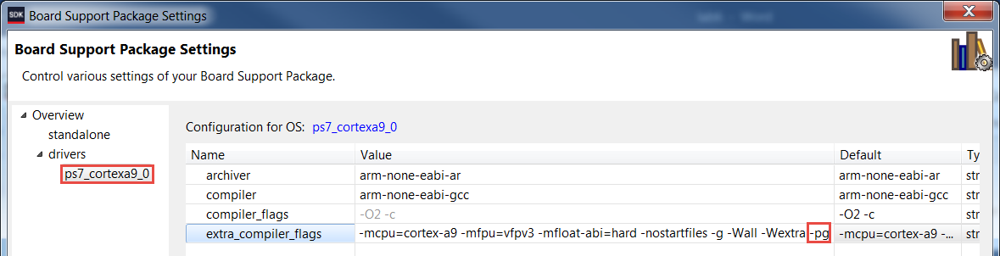
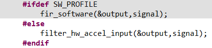
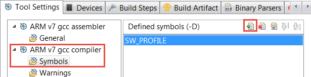
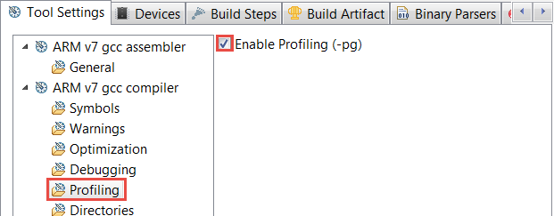
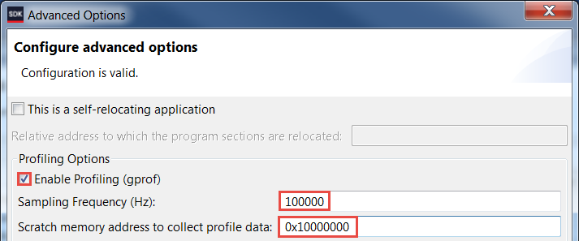
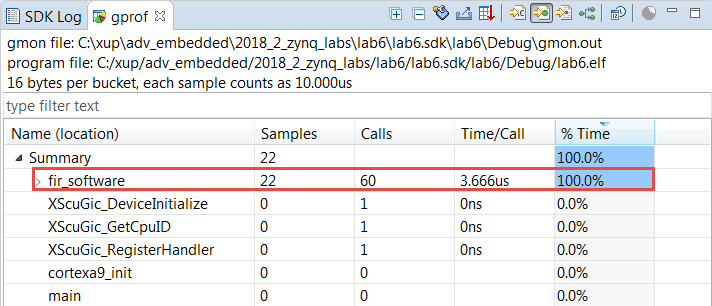
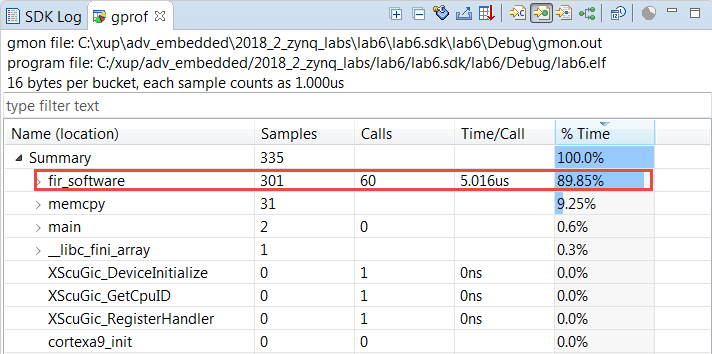

# Profiling and Performance Tuning

## Objectives

After completing this lab, you will be able to:

* Setup the board support package (BSP) for profiling an application
* Set the necessary compiler directive on an application to enable profiling
* Setup the profiling parameters
* Profile an application and analyze the output

## Steps
## Create a Vivado Project
### Launch Vivado and create an empty project, called lab6, targeting the PYNQ-Z1 or PYNQ-Z2 boards and using the Verilog language.
1. Open Vivado and create a new project new project call _lab6_ in the **{labs}** directory.
1. Select the **RTL Project** option in the _Project Type_ form, and click **Next**.
1. Select **Verilog** as the _Target Language_ in the _Add Sources_ form, and click **Next**.
1. Click **Next** two times.
1. In the _Default Part_ form, click on _Boards_ filter and Select **www.digilentinc.com** for the _PYNQ-Z1_ board, **tul.com.tw** for the _PYNQ-Z2_ board in the Vendor field, select _PYNQ-Z1__or pynq-z2_, and click **Next**.
1. Click **Finish** to create an empty Vivado project.
### Set the project settings to include provided fir\_top IP
1. Click **Settings** in the _Flow Navigator_ pane.
1. Expand **IP** in the left pane of the _Project Settings_ form.
1. Click Repository and using &quot;minus&quot; button remove entries, if any.
1. Click on the &quot;plus&quot; button, browse to **{sources}\lab6\** and click **Select**.
1. Click **OK**.

    The directory will be scanned and it will report one IP was detected.

1. Click **OK** twice.
## Creating the Hardware System Using IP Integrator
### Create a block design in the Vivado project using IP Integrator to generate the Zynq ARM Cortex-A9 processor based hardware system.
1. In the Flow Navigator, click **Create Block Design** under IP Integrator.
1. Name the block **system** and click **OK**.
1. Click on the  button.
1. Once the IP Catalog is open, type **zy** into the Search bar, and double click on **ZYNQ7 Processing System** entry to add it to the design.
1. Click _Run Block Automation_,and click **OK** to accept the default settings.
1. Double click on the Zynq block to open the _Customization_ window for the Zynq processing system.

    A block diagram of the Zynq should now be open, showing various configurable blocks of the Processing System.

### Configure the I/O Peripherals block to only have UART 0 support.
1. Click on the _MIO Configuration_ panel to open its configuration form.
1. Expand the _I/O Peripherals_ on the right.
1. Uncheck _ENET 0_, _USB 0_, and _SD 0_, _GPIO (GPIO MIO)_, leaving _UART 0_ selected.
1. Click **OK**.

    

    
    

    

    <i>ZYNQ Processing System configured block</i>
    

## Add FIR Core to the System
### Instantiate the provided FIR core twice naming the instances as fir\_left and fir\_right. Validate the design.
    1.
1. Click the  button and search for **fir** in the catalog.
1. Double-click on the **fir\_top\_v1\_0** to add the IP instance to the system
1. Select the _fir\_top\_1_ instance and change its name to **fir\_left** in its property form.
1. Click the  button and search for **fir** in the catalog.
1. Double-click on the **fir\_top\_v1\_0** to add the IP instance to the system
1. Select the _fir\_top\_1_ instance and change its name to **fir\_right** in its property form.
1. Click on **Run Connection Automation** , and select **All Automation** to select _fir\_left_ and _fir\_right_ **.**
1. Click on _s\_axi\_fir\_io_ for both _fir\_left_ and _fir\_right_ and confirm that they will be automatically connected to the Zynq _M\_AXI\_GP0_ port
1. Click **OK** toconnect the two blocks to the _M\_AXI\_GP0_

    The design should look similar to shown below:

    

    
    

    

    <i>The completed design</i>
    

     It is not necessary to connect the _interrupt_ signals of the _fir_ blocks.

1. Select the _Diagram_ tab, and click on the  (Validate Design) button to make sure that there are no errors.

    Ignore warnings.

## Generate the Bitstream
### Create the top-level HDL of the embedded system, and generate the bitstream.
1. In Vivado, select the _Sources_ tab, expand the _Design Sources,_ right-click the _system.bd_ and select **Create HDL Wrapper** and click **OK**.
1. Click on the **Generate Bitstream** in the _Flow Navigator_ pane to synthesize and implement the design, and generate the bitstream.
1. Click **Save** to save the design and **Yes** to run the necessary processes. Click **OK** to launch the runs.
1. When the bitstream generation process has completed click **Cancel.**
## Export the Design to the SDK 
### Export the design to the SDK, create the software BSP using the standalone operating system and enable the profiling options.
1. Export the hardware configuration by clicking **File &gt; Export &gt; Export Hardware…**
1. Tick the box to _Include Bitstream_, and click **OK**
1. Launch SDK by clicking **File &gt; Launch SDK** and click **OK**
1. In SDK, select **File** &gt; **New** &gt; **Board Support Package.**
1. Notice **Standalone\_bsp\_0** in the **Project name** field and click **Finish** with default settings.

    A Board Support Package Settings window will appear.

1. Select the **Overview &gt; standalone** entry in the left pane, click on the drop-down arrow of the _enable\_sw\_intrusive\_profiling Value_ field and select **true**.

    

    
    

    

    <i>Enable profiling in the board support package</i>
    

1. Select the **Overview &gt; drivers &gt; cpu\_cortexa9** and add **–pg** in the _extra\_compiler\_flags__Value_ field.

    

    
    

    

    <i>Adding profiling switch</i>
    

1. Click **OK** to accept the settings and create the BSP.
## Create the Application
### Create the _lab6_ application using the provided lab6.c, fir.c, fir.h, fir\_coef.dat, and xfir\_fir\_io.h  files.
1. Select **File** &gt; **New** &gt; **Application Project.**
1. Enter **lab6** as the project name, select the **Use existing** _standalone\_bsp\_0_ option, and click **Next**.
1. Select **Empty Application** in the _Available Templates_ pane and click **Finish**.
1. In the _lab6_ project, right click on the _src_ directory and select **Import.**
1. Expand the General folder and double-click on **File system,** and browse to the **{sources}\lab6** directory.
1. Select **fir\_coef.dat, fir.c, fir.h, lab6.c,** and **xfir\_fir\_io.h,** and click **Finish.**

    The program should compile successfully and generate the lab6.elf file.

1. Open the _lab6.c_ file and scroll to the main function at the bottom. Notice the following code:

    

    
    

    

    <i>Source code snippet</i>
    

     The function _fir\_software_( ) function is a software implementation of the FIR function. The _filter\_hw\_accel\_input_( ) function offloads the FIR function to the two FIR blocks that have been implemented in the PL.

## Run the Application and Profile
### Place the board into the JTAG boot up mode. Program the PL section and run the application using the user defined SW\_PROFILE symbol.
1. Place the board in the JTAG boot up mode.
1. Power ON the board.
1. Select **Xilinx &gt; Program FPGA** and click on **Program**.
1. Right click on the _lab6 directory_, and select **C/C++ Build Settings**.
    5.
1. Under the **ARM v7 gcc compiler** group, select the **Symbols** sub-group **,** click on the  button to open the value entry form, enter **SW\_PROFILE** , and click **OK**.

    This will allow us to profile the software loop of the FIR application.

    

    
    

    

    <i>Add user-defined symbol</i>
    

1. Under the **ARM v7 gcc compiler** group, select the **Profiling** sub-group, then check the **Enable Profiling** box, and click **OK**.

    

    
    

    

    <i>Compiler setting for enabling profiling</i>
    

1. From the menu bar, Select **Run &gt; Run Configurations…** and double click on _Xilinx C/C++ application (System Debugger)_ to create a new configuration.
1. Click on the newly created **lab6 Debug** configuration, and select the **Application** tab.
1. Click on the _Advance Options_ **Edit…** button.
1. Click on the _Enable Profiling (gprof)_ check box, enter **100000** (100 kHz) in the Sampling Frequency field, enter **0x10000000** in the scratch memory address field, and click **OK**.

    

    
    

    

    <i>Profiling options</i>
    

1. Click **Apply** and then click the **Run** button to download the application and execute it.

    The program will run.

### Analyze the results.
1. When execution is completed, the Gmon File Viewer dialog box will appear showing _lab6.elf_ as the corresponding binary file.  Click **OK**.
1. Click on the **Sort samples per function** button ()
).
1. Click in the **%Time** column to sort in the descending order.

    Note that the fir\_software routine is called 60 times, 22 samples were taken during the profiling, and on an average of 3.333 (PYNQ-Z1) or 3.666 (PYNQ-Z2/PYNQ-Z2)microseconds were spent per call.

    

    
    

    

    <i>Sorting results</i>
    

1. Go back to the _Run Configuration_, and change the sampling frequency to **1000000** (1 MHz) and profile the application again.
1. When execution is completed, click **OK** and the gprof viewer will be updated.
1. Invoke **gprof** , select the **Sorts samples per function** output, and sort the **%Time** column.

   Notice that the output has better resolution and reports more functions and more samples per function calls. Note that the number of calls to the fir\_software function has not changed but the number of samples taken increased, and the average time spent per call is 5.250 (PYNQ-Z1) or 5.016 (PYNQ-Z2) microseconds in the figure below.

    

    
    

    

    <i>Profiled results with 1 MHz sampling frequency</i>
    

    At this stage, the designer of the system would decide if the FIR function should be ported to hardware.

### Profile the application using the hardware FIR filter IP by removing the user defined SW\_PROFILE symbol.
1. Select the _lab6_ application, right-click, and select **C/C++ Build Settings**.
1. Under the **ARM v7 gcc compiler** group, select the **Symbols** sub-group **,** select **SW\_PROFILE** , and delete it by clicking on the delete button.

    This will allow us to profile the hardware IP of the FIR application.

    

    
    

    

    <i>Deleting the user-defined symbol</i>
    

1. Click **Apply** , and then click **OK**
1. Select **Run &gt; Run Configurations** and click the **Run** button to profile the application again and click **OK** when profiling completes.

    Notice that the output now shows filter\_hw\_accel\_input function call instead of the fir\_software function call. Note that the average time spent per call is much less as the filtering is done in the hardware instead of the software.

1. Close the SDK and Vivado programs by selecting **File &gt; Exit** in each program.
1. Turn OFF the power on the board.

## Conclusion

This lab led you through enabling the software BSP and the application settings for the profiling.  You went through creating the hardware which included the hardware IP and was later profiled in the application.  You analyzed the profiled application output.